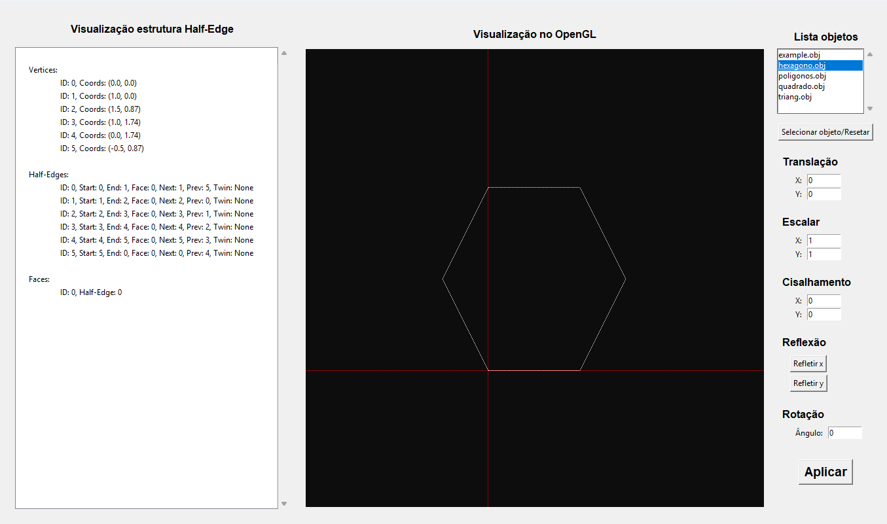
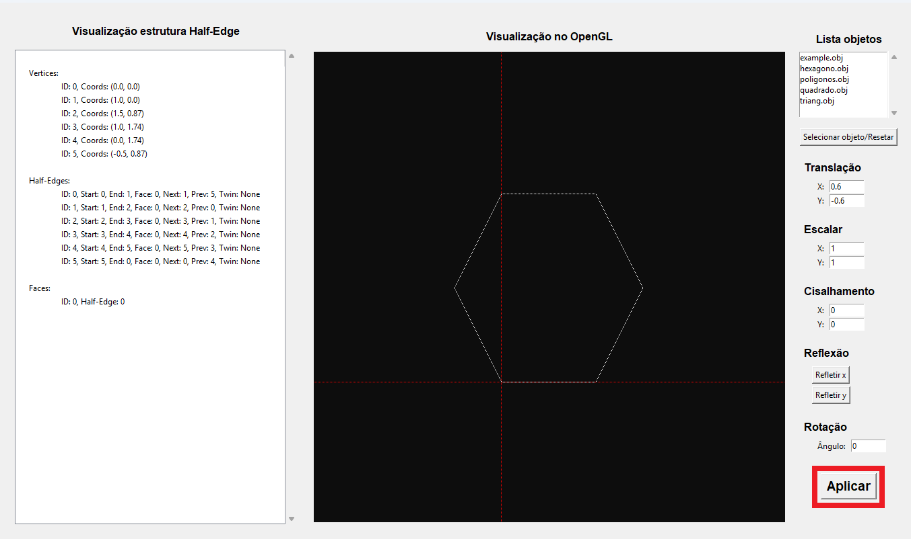
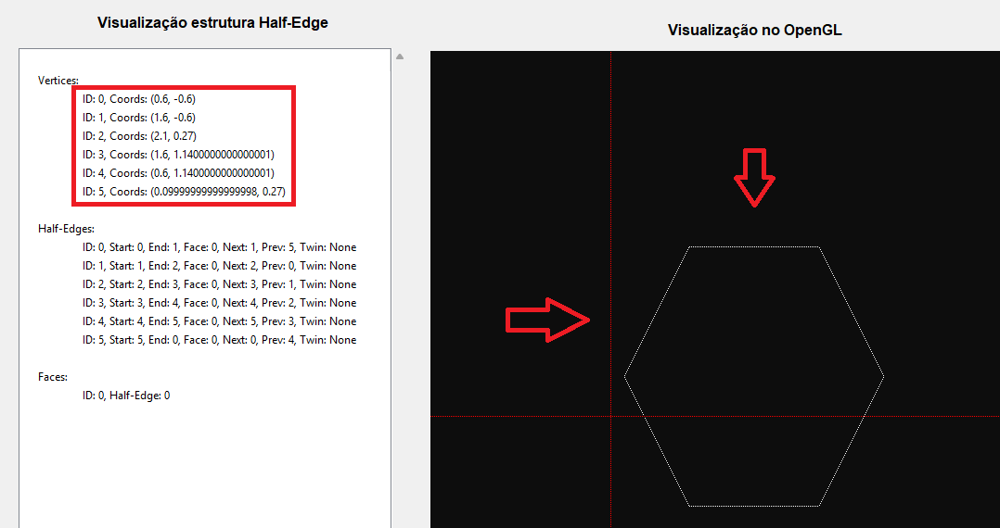

# Half-Edge-Studio

A desktop application for visualization and manipulation of Half-Edge data structures in computational geometry. The project implements 2D geometric operations with real-time visualization using OpenGL.

## 📋 About the Project

**Half-Edge-Studio** is an educational tool that demonstrates the Half-Edge data structure, a fundamental representation in computer graphics and computational geometry. The application allows you to load OBJ models, visualize them graphically, and apply geometric transformations such as translation, scaling, rotation, shearing, and reflection.

### Features

- **Model loading**: Support for OBJ format files
- **Half-Edge structure visualization**: Detailed display of vertices, edges, and faces
- **OpenGL rendering**: Real-time 2D visualization with Bresenham's algorithm
- **Geometric transformations**:
  - Translation (X, Y)
  - Scaling (X, Y)
  - Rotation (in degrees)
  - Shearing (X, Y)
  - Reflection (X or Y axis)
- **Topological queries**:
  - Adjacent faces to a face
  - Adjacent faces to an edge
  - Faces sharing a vertex
  - Edges sharing a vertex

## 🏗️ Project Structure

```
Half-Edge-Studio/
├── main.py                      # Application entry point
├── core/
│   ├── estruturas_base.py      # Base classes: Vertex, HalfEdge, Face
│   ├── half_edge_estrutura.py  # Structure construction logic
│   ├── half_edge_funcoes.py    # Operations and topological queries
│   └── funcoes_modificacao.py  # Geometric transformations
├── interface/
│   ├── gui.py                  # Main graphical interface (Tkinter)
│   ├── interface_openGL.py     # OpenGL rendering
│   └── logica.py               # File loading logic
└── arquivos_objetos/           # Directory for OBJ files (auto-created)
```

## 🛠️ Technologies Used

- **Python 3.8+**
- **Tkinter**: Graphical interface
- **PyOpenGL**: Graphics rendering
- **PyOpenGL-tk**: OpenGL integration with Tkinter

## 📦 Installation

### Prerequisites

- Python 3.8 or higher
- pip (Python package manager)

### Installation Steps

1. **Clone the repository**:
```bash
git clone https://github.com/Brun0r0/Half-Edge-Studio.git
cd Half-Edge-Studio
```

2. **Create a virtual environment (recommended)**:
```bash
python -m venv venv

# Windows
venv\Scripts\activate

# macOS/Linux
source venv/bin/activate
```

3. **Install dependencies**:
   
```bash
pip install PyOpenGL PyOpenGL_accelerate pyopengltk
```

## 🚀 How to Run

Execute the program from the root directory:

```bash
python main.py
```

The application will open a window with the graphical interface.

## 💻 How to Use

### Main Interface

The application has three main panels:


1. **Control Panel (Right)**
   - List of loaded objects
   - Geometric transformation parameters
   - Application buttons

2. **OpenGL Visualization (Center)**
   - Real-time graphical rendering of the model
   - Displays reference axes in red
   - Automatically adjusts visualization to window size

3. **Half-Edge Structure (Left)**
   - Tree-view display of vertices, edges, and faces
   - Detailed information about connectivity

### Step by Step

1. **Load a model**:
   - Place an `.obj` file in the `arquivos_objetos/` folder
   - Click the file name in the list
   - Click the "Select object/Reset" button

2. **View the structure**:
   - The Half-Edge structure will be displayed in the left panel
   - The model will be rendered in the OpenGL panel

  <div align="center">
    
    <p><i>Screen with figure already selected</i></p>
  </div>

3. **Apply transformations**:
   - Enter the desired values in the input fields
   - Click the "Apply" button
   - Changes will be reflected in real-time
  
   - Example: Let's translate this figure

   <div align="center">
    
    <p><i>Translate config</i></p>
  </div>

  <div align="center">
    
    <p><i>Translate demonstration</i></p>
  </div>


### Transformation Parameters

| Parameter | Description | Default Value |
|-----------|-------------|-----------------|
| **Translation X** | Horizontal movement | 0 |
| **Translation Y** | Vertical movement | 0 |
| **Scaling X** | Scale factor in X | 1 |
| **Scaling Y** | Scale factor in Y | 1 |
| **Shearing X** | Shearing parameter in X | 0 |
| **Shearing Y** | Shearing parameter in Y | 0 |
| **Rotation Angle** | Rotation in degrees (0-360) | 0 |

## 📄 OBJ File Format

The project supports the standard OBJ format with the following specifications:

```
# Vertices (2D coordinates)
v x y

# Faces (vertex references)
f v1 v2 v3 ...
f v1/vt1 v2/vt2 v3/vt3 ...
```

**Example**:
```
v 0 0
v 10 0
v 10 10
v 0 10
f 1 2 3 4
```

## 🔍 Half-Edge Data Structure

The Half-Edge structure consists of three main components:

### Vertex
- Coordinates (x, y)
- Reference to an incident half-edge
- Unique ID

### Half-Edge (Directional Edge)
- Start and end vertices
- Reference to the adjacent face
- Next and previous half-edge of the face
- Twin (opposite half-edge)
- Unique ID

### Face
- Reference to one half-edge of its boundary
- Unique ID

## 📊 Topological Query Examples

The Half-Edge structure enables fast queries:

- Find all edges incident to a vertex: **O(d)**, where d is the vertex degree
- List faces adjacent to a face: **O(n)**, where n is the number of face edges
- Find the opposite face to an edge: **O(1)**

## 🎨 Rendering

The project uses **Bresenham's Algorithm** for line rasterization, ensuring efficient rendering of graphic primitives. The visualization automatically adjusts zoom and position so the object fits on the screen.

## 📝 Code Structure

### `core/estruturas_base.py`
Defines base classes for the Half-Edge structure with simple getters and setters.

### `core/half_edge_estrutura.py`
Implements structure creation and management, including:
- Vertex addition
- Half-edge creation with automatic twin
- Polygonal face construction

### `core/half_edge_funcoes.py`
Operations on the structure:
- OBJ file parsing
- Structure text visualization
- Topological queries

### `core/funcoes_modificacao.py`
Geometric transformations:
- Translation, scaling, rotation
- Shearing and reflection

### `interface/gui.py`
Main interface with Tkinter, managing user interaction.

### `interface/interface_openGL.py`
OpenGL rendering with world-to-screen conversion and Bresenham's algorithm.

## 🐛 Troubleshooting

### Error: "ModuleNotFoundError: No module named 'OpenGL'"
```bash
pip install PyOpenGL PyOpenGL-tk
```

### OpenGL window does not render
- Verify that your graphics card supports OpenGL
- Try updating your graphics drivers

### No objects appear in the list
- Create the `arquivos_objetos/` folder manually if it doesn't exist
- Make sure files have the `.obj` extension
- Verify that the OBJ format is correct

## 📚 References

- [Half-Edge Data Structure - Computational Geometry](https://en.wikipedia.org/wiki/Doubly_connected_edge_list)
- [OpenGL Tutorial](https://learnopengl.com/)
- [Wavefront OBJ Format](https://en.wikipedia.org/wiki/Wavefront_.obj_file)

## 📄 License

This project is provided as-is for educational purposes.

## 👤 Author

Developed by **Gabriel Castaman Brunoro**

---

**Last update**: 2025
